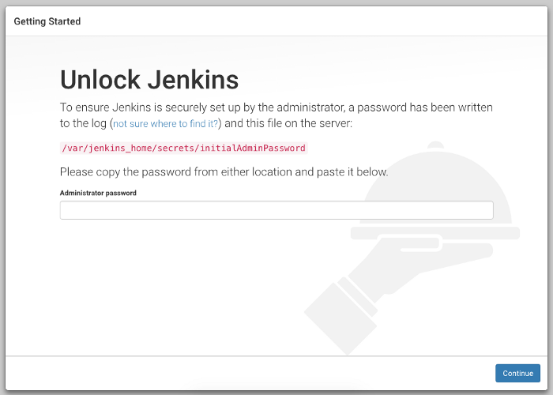

# CI/CD for Docker
In this lab we will create an entire environment of developement.
We will create a basic ci/cd for docker that will build the image and push it to your docker hub account.

## Requirements
This lab assumes that you are running on a linux machine (MACOS is also good).
Please install theese softwares on your machine/workstation:
1. docker 
1. docker-compose

## Environment
This is your working directory for this lab (Labs/ci-cd-docker).

## GitHub
Please create a GitHub account at: https://github.com/

## Docker Hub
Please create a docker hub account at: https://hub.docker.com/

## Jenkins
1. Attached there is a Dockerfile. It will be your jenkins (also docker installed inside)
1. Run this command:  
    `docker build . -t devops-culture/jenkins-docker:1`
1. Ensure that the docker image created:  
    `docker image ls`
1. Attached there is a docker-compose.yml file. It will set up your Jenkins server.
1. On your own:
* Look at the compose file and see whats inside.
* Find the address that jenkins will listen to.
1. run in the working directory:  
    `docker-compose up -d`
1. View the generated administrator password to log in the first time:  
    `docker exec jenkins cat /var/jenkins_home/secrets/initialAdminPassword`
1. Enter jenkins and log in.

## Jenkinsfile
Attached is a Jenkinsfile for this lab.

### Explenation
In this pipeline, We have 2 environment variables to change the registry and the credential easily.
The job will have one step.Docker build command will be run by utilizing the jenkins build number in the docker tag.

## Biblography
This Lab is based on this websites:
https://medium.com/@gustavo.guss/quick-tutorial-of-jenkins-b99d5f5889f2
https://medium.com/@gustavo.guss/jenkins-building-docker-image-and-sending-to-registry-64b84ea45ee9