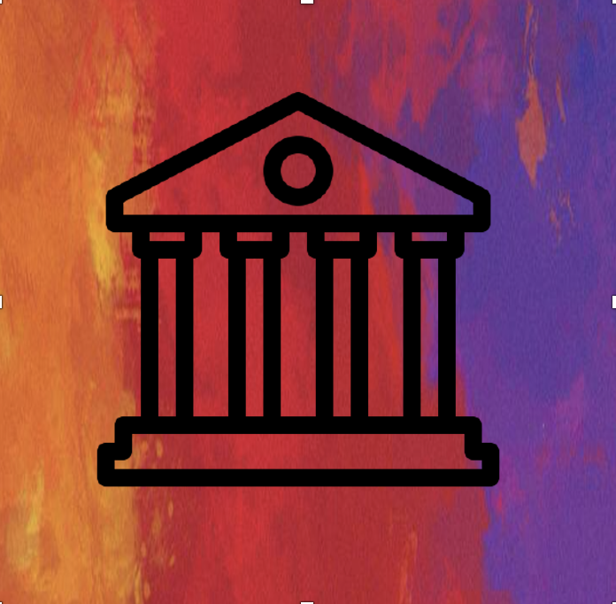

    

# devops-culture
Ideas &amp; concepts that will help you become a great Develoepr / Devops / SRE, whatever you want to be!

## Inroduction
This document is created to help developers and operations as one to get easily inside the world of devops.
In general, knowing these concepts and ideas will help you to become better in any field.
There are more specific information to some stuff and its inside it's specific folder.  
  
Concepts are the biggest section, as the world of application and its ecosystem evolves, there are more thing to learn in order to understand the big picture. Still, There is no section which more important than other. Some gives you knowledge, and some gives you a way to learn and evolve on your own, so don't skip anything.  
  
It is always a pleasure to get an issue or even a PR.  
Please, if you liked this repository, give us a star on GitHub, it will help more people to be aware to this repo.  
Hope it will help you!

## Devops RoadMap

This is the check list (or step by step guide) to become a devops/SRE (or whatever you want to call it):
https://roadmap.sh/devops

I don't think that's the perfect and full example but it sure help to understand the basics of what you need to know - yes, you need to know everything :)

----
## Concepts

### What is Devops
1. [Quick and simple video](https://www.youtube.com/watch?v=_I94-tJlovg)
1. [What is devops by Amazon](https://aws.amazon.com/devops/what-is-devops/)
1. [What is devops by Atlassian](https://www.atlassian.com/devops)

### CI/CD
1. [What is CI/CD by RedHat](https://www.redhat.com/en/topics/devops/what-is-ci-cd)
1. [What is CI/CD by Codefresh](https://codefresh.io/continuous-integration/continuous-integration-delivery-pipeline-important/?utm_source=google&amp;utm_medium=cpc&amp;utm_campaign=docker-ci-cd&amp;utm_term=ci%20cd%20tools&amp;gclid=Cj0KCQjw6sHzBRCbARIsAF8FMpVQCgsC9ozvQGx0wuzZK6h1WAeH0tafDfyg-_H23L0eHSiRgajxIdEaAmkeEALw_wcB)
1. [CI &amp; Continuous Delivery vs. Continuous Deployment by Atlassian](https://www.atlassian.com/continuous-delivery/principles/continuous-integration-vs-delivery-vs-deployment)
1. [Devops Assembly Lines](https://www.xenonstack.com/blog/devops-assembly-line/)

### Gitops
1. [GitOps by weaveworks](https://www.gitops.tech)
1. [GitOps Community](https://gitops-community.github.io)
1. [OpenGitOps](https://opengitops.dev/about)

### Configuration Management
1. [What is configuration management by DigitalOcean](https://www.digitalocean.com/community/tutorials/an-introduction-to-configuration-management)
1. [What is configuration management by RedHat](https://www.redhat.com/en/topics/automation/what-is-configuration-management)
1. [The importance of configuration management](https://medium.com/faun/the-importance-of-configuration-management-cm-for-successful-software-development-25ee60829e9b)

### Cloud Services
1. [What is Cloud Computing by Amazon](https://aws.amazon.com/what-is-cloud-computing/)
1. [What is Cloud services by RedHat](https://www.google.com/url?sa=t&rct=j&q=&esrc=s&source=web&cd=&ved=2ahUKEwjx75m-lvrqAhUNDuwKHXQsBq8QFjAYegQICBAB&url=https%3A%2F%2Fwww.redhat.com%2Fen%2Ftopics%2Fcloud-computing%2Fwhat-are-cloud-services&usg=AOvVaw0fE1gad5auCREo0yc8dQwH)
1. [Best practices for production cloud service](https://medium.com/@crismerritt/dont-overlook-these-8-essential-best-practices-for-production-cloud-services-9b2145f5cb1e)

### Infrastructure as a Code
1. [IaC by Microsoft](https://docs.microsoft.com/en-us/azure/devops/learn/what-is-infrastructure-as-code)
1. [IaC by Crate.io](https://crate.io/a/infrastructure-as-code-part-one/)

### Testing
1. [Software Testing Fundementals (all code is guilty until proven innocent)](https://softwaretestingfundamentals.com/)
1. [Parallel testing](https://help.crossbrowsertesting.com/selenium-testing/getting-started/what-is-parallel-testing/)
1. [Performance Testing vs. Load Testing vs. Stress Testing by BlazeMeter](https://www.blazemeter.com/blog/performance-testing-vs-load-testing-vs-stress-testing)
1. [Cross Browser Testing](https://www.softwaretestinghelp.com/how-is-cross-browser-testing-performed/)

### Microservices
1. [Microservices by Martin Fowler (OG)](https://martinfowler.com/articles/microservices.html)
1. [Microservices in a nutshell](https://medium.com/hashmapinc/the-what-why-and-how-of-a-microservices-architecture-4179579423a9)
1. [Microservices architecthure style by Microsoft](https://docs.microsoft.com/en-us/azure/architecture/guide/architecture-styles/microservices)
1. [What are microservices by RedHat](https://www.redhat.com/en/topics/microservices/what-are-microservices)
1. [Microservices.com](https://microservices.io)

### Versioning
1. [Semantic Versioning](https://semver.org)

### Git
1. [Git Workflows](https://www.atlassian.com/git/tutorials/comparing-workflows)
2. [Git Branching](https://learngitbranching.js.org)

### Observability & Monitoring
1. [The Golden Triangle of Observability in Monitoring](https://devops.com/metrics-logs-and-traces-the-golden-triangle-of-observability-in-monitoring/)
1. [Key Differences Between Observability and Monitoring – And Why You Need Both (Coralogix)](https://coralogix.com/blog/key-differences-between-observability-and-monitoring-and-why-you-need-both/)

### Events & Apache Kafka
1. [Apache Kafka® Fundamentals by confluent](https://www.youtube.com/watch?v=-DyWhcX3Dpc&list=PLa7VYi0yPIH2PelhRHoFR5iQgflg-y6JA)
### Service Mesh
1. [Service mesh by HashiCorp (consul concept overview)](https://www.youtube.com/watch?v=8T8t4-hQY74&t=1s)
1. [Service mesh security by HashiCorp (consul connect overview)](https://www.youtube.com/watch?v=mxeMdl0KvBI)

### Security
1. [What is devsecops by RedHat](https://www.redhat.com/en/topics/devops/what-is-devsecops)
1. [DevSecOps community](https://github.com/devsecops/devsecops)
1. [Awsome DevSecOps](https://github.com/devsecops/awesome-devsecops)
1. [DevSecOps manifesto](https://www.devsecops.org/)
1. [OpenSource security foundation](https://openssf.org)

### Web servers
1. [Web servers introduction](https://developer.mozilla.org/en-US/docs/Learn/Common_questions/What_is_a_web_server)
1. [What is a proxy server by Varonis](https://www.varonis.com/blog/what-is-a-proxy-server/)
1. [What is a reverse proxy by NGINX](https://www.nginx.com/resources/glossary/reverse-proxy-server/)

### API & REST
1. [REST API Tutorial](https://restfulapi.net)
1. [REST: Good Practices for API Design](https://medium.com/hashmapinc/rest-good-practices-for-api-design-881439796dc9)
1. [Web API design by Microsoft](https://docs.microsoft.com/en-us/azure/architecture/best-practices/api-design)

### HTTP/S
1. [HTTP fundementals](https://developer.mozilla.org/en-US/docs/Web/HTTP/Basics_of_HTTP)

### README.md
1. [Syntax guidance for basic Markdown usage by Microsoft](https://docs.microsoft.com/en-us/azure/devops/project/wiki/markdown-guidance?view=azure-devops#:~:text=In%20a%20Markdown%20file%20or,text%20on%20a%20new%20line.)
1. [The MarkDown Guide](https://markdown-guide.readthedocs.io/en/latest/index.html)

## Ideas
1. [Google SRE](https://sre.google/sre-book/table-of-contents/)
1. [The Twelve-Factor App](https://12factor.net)
1. [Google SRE Workbook](https://sre.google/workbook/table-of-contents/)
1. [The secret lives of data (RAFT)](http://thesecretlivesofdata.com/raft/)
1. [AWS Well-Architected and the Five Pillars](https://aws.amazon.com/architecture/well-architected/?wa-lens-whitepapers.sort-by=item.additionalFields.sortDate&wa-lens-whitepapers.sort-order=desc)

## Blogs and Channels
1. [Devops Toolkit by Viktor farcic](https://www.youtube.com/channel/UCfz8x0lVzJpb_dgWm9kPVrw)
1. [Anais Urlichs](https://www.youtube.com/c/AnaisUrlichs)
1. [Bret Fisher](https://www.bretfisher.com)
1. [Bret Fisher Blog](https://newsletter.bretfisher.com)
1. [Bret Fisher "Ask Me Anything"](https://github.com/BretFisher/ama)
1. [TGI Kubernetes by Joe Beda](https://www.youtube.com/watch?v=9YYeE-bMWv8&list=PL7bmigfV0EqQzxcNpmcdTJ9eFRPBe-iZa&index=99)

## Know these foundations
1. [CNCF](https://www.cncf.io/)
   - [CNCF Landscape](https://landscape.cncf.io/)
1. [Linux Foundation](https://www.linuxfoundation.org/projects/cloud/)
   - [CI Best Practices Badge Program](https://bestpractices.coreinfrastructure.org/en)
1. [CD Foundation](https://cd.foundation/)

## Community
There are a lot of communities around the world. Find yours at the [community.md](community.md)

## Know these websites
1. [Medium](https://medium.com) (Advice: Pay 5$ per month and create an account)
1. [DEV community](https://dev.to)
1. [The Devop Guy YouTube Channel](https://www.youtube.com/channel/UCFe9-V_rN9nLqVNiI8Yof3w)
1. [AppsFlyer Engineering Blog](https://medium.com/appsflyer)
1. [Taboola Engineering Blog](https://blog.taboola.com/category/engineering/)
1. [The Netflix Tech Blog](https://netflixtechblog.com)
1. [Medium Container Hub by Codefresh](https://medium.com/containers-101)
1. [TechWorld with Nana Channel](https://www.youtube.com/channel/UCdngmbVKX1Tgre699-XLlUA)
1. [MDN Web Docs](https://developer.mozilla.org/en-US/)

## Hubs
1. [Docker Hub](https://hub.docker.com)
1. [Operator Hub](https://operatorhub.io)
1. [Artifact Hub](https://artifacthub.io)

## Hands-On
List of learning sources to study from.
For the list of learning sources: [Hands-On Learning Sources](hands-on.md)

----

## More to talk about
I'm here to talk about anything else, please reach out or if your'e close to me, lets sit for a coffee!

<a class="badge-base__link LI-simple-link" href="https://il.linkedin.com/in/itamar-marom?trk=profile-badge">Itamar Marom</a>
